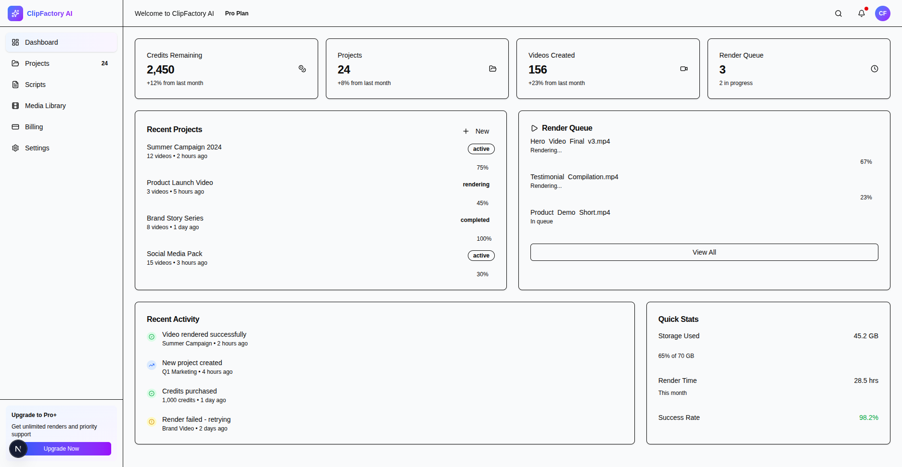

# ClipFactory AI Dashboard

A modern, responsive dashboard application built with Next.js 15 and TailwindCSS for managing video projects and content creation.


## Features

-   🎨 **Clean UI**: Modern dashboard with professional design
-   📊 **Dashboard Metrics**: Track credits, projects, videos, and render queue
-   📁 **Project Management**: View and manage video projects
-   📝 **Script Editor**: Create and manage video scripts
-   🎬 **Media Library**: Organize media assets
-   💳 **Billing**: Credit purchase and subscription management
-   ⚙️ **Settings**: User preferences and account settings
-   📱 **Responsive Design**: Works seamlessly on all devices

## Tech Stack

-   **Framework**: [Next.js 15](https://nextjs.org/) (App Router)
-   **Styling**: [TailwindCSS](https://tailwindcss.com/)
-   **Language**: [TypeScript](https://www.typescriptlang.org/)
-   **Package Manager**: npm

## Getting Started

### Prerequisites

-   Node.js 18+ installed
-   npm or yarn

### Installation

1. Clone the repository:

```bash
git clone <repository-url>
cd test-task
```

2. Install dependencies:

```bash
npm install
```

3. Run the development server:

```bash
npm run dev
```

4. Open [http://localhost:3000](http://localhost:3000) in your browser

### Build for Production

```bash
npm run build
npm start
```

## Project Structure

```
test-task/
├── app/                      # Next.js App Router pages
│   ├── layout.tsx           # Root layout with Sidebar & Header
│   ├── page.tsx             # Dashboard homepage
│   ├── projects/            # Projects page
│   ├── scripts/             # Scripts page
│   ├── media-library/       # Media library page
│   ├── billing/             # Billing page
│   └── settings/            # Settings page
├── components/              # Reusable React components
│   ├── Sidebar.tsx          # Navigation sidebar
│   ├── Header.tsx           # Top header bar
│   └── DashboardCard.tsx    # Metric card component
└── public/                  # Static assets
```

## Pages

### Dashboard (/)

-   Overview metrics with trend indicators
-   Recent activity timeline
-   Quick action buttons

### Projects (/projects)

-   List of all video projects
-   Status indicators
-   Project statistics

### Scripts (/scripts)

-   Script management interface
-   Create new scripts

### Media Library (/media-library)

-   Media asset organization
-   Upload functionality (UI only)

### Billing (/billing)

-   Current subscription plan
-   Credit balance
-   Credit purchase options

### Settings (/settings)

-   Profile settings
-   User preferences
-   Email notifications

## Development Notes

See [DEVELOPMENT.md](./DEVELOPMENT.md) for detailed development notes, architecture decisions, and implementation details.

## Deployment

### Deploy to Vercel

[](https://vercel.com/new/clone)

1. Push your code to GitHub
2. Import the repository in Vercel
3. Vercel will auto-detect Next.js and deploy

The app requires no environment variables for basic functionality.

## Screenshots



## License

This project is created as a test task demonstration.

## Time Taken

⏱️ Approximately **45-60 minutes** including:

-   Project setup and configuration
-   Component development
-   Page implementation
-   Styling and responsive design
-   Testing and refinement
-   Documentation
